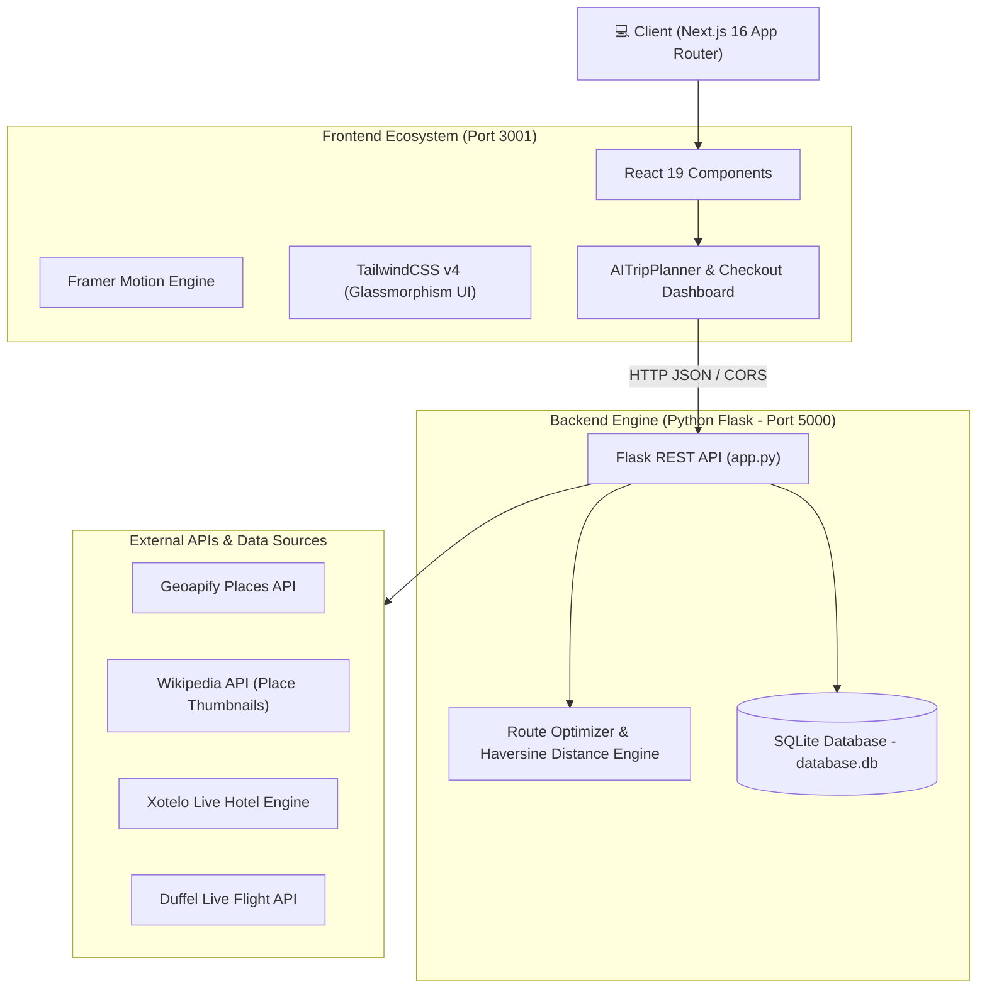

# ✈️ AeroTravel — AI Travel Planner & Luxury Package Platform

> **AeroTravel** is an end-to-end, high-performance travel itinerary generation and package booking engine built with a **Python Flask REST backend** and a **Next.js 16 (React 19) frontend**. It features real-time route optimization using the Haversine formula and TSP heuristics, live flight and hotel data integration, dynamic tiered guide/accommodation math, interactive 3D payment cards, and SQLite persistent storage.

---

## 📐 System Architecture

The application follows a modern **decoupled client-server architecture**:



---

## 🛠️ Technology Stack

### **Backend (`app.py`)**
* **Framework**: Python Flask 3.x
* **CORS**: `flask_cors` (enabled for `http://localhost:3000` & `http://localhost:3001`)
* **Database**: SQLite3 (`database.db`) with optimized indices
* **Environment**: `python-dotenv` for API key secret management
* **APIs Integrated**: Geoapify, Wikipedia, Xotelo, Duffel

### **Frontend (`travel-app`)**
* **Framework**: Next.js 16.2.7 (App Router with Turbopack)
* **Core Library**: React 19.2.4
* **Styling**: TailwindCSS v4, Lucide React icons, Glassmorphism design tokens
* **Animations**: Framer Motion 12.40.0
* **Visual Effects**: `canvas-confetti` celebration triggers

---

## 🧠 Algorithmic Engine & Technical Details

### 1. Geo-Distance & Route Optimization Algorithm
When generating a multi-day trip, the backend processes location coordinates to build optimal day-by-day routes that minimize transit times and cab fares.

#### **A. Haversine Distance Formula**
To calculate the great-circle distance between two latitude/longitude pairs $(\text{lat}_1, \text{lon}_1)$ and $(\text{lat}_2, \text{lon}_2)$:

$$\Delta \text{lat} = \text{lat}_2 - \text{lat}_1 \quad (\text{converted to radians})$$
$$\Delta \text{lon} = \text{lon}_2 - \text{lon}_1 \quad (\text{converted to radians})$$

$$a = \sin^2\left(\frac{\Delta \text{lat}}{2}\right) + \cos(\text{lat}_1) \cdot \cos(\text{lat}_2) \cdot \sin^2\left(\frac{\Delta \text{lon}}{2}\right)$$

$$c = 2 \cdot \arctan2\left(\sqrt{a}, \sqrt{1-a}\right)$$

$$d = R \cdot c \quad \text{where } R = 6371 \text{ km (Earth's radius)}$$

#### **B. Nearest-Neighbor TSP Heuristic**
Places in a selected city are clustered and ordered using a Traveling Salesperson Problem (TSP) nearest-neighbor heuristic to ensure sights visited on the same day are geographically adjacent, preventing backtrack travel.

#### **C. Dynamic Cab Fare Calculation**
$$\text{Cab Fare (₹)} = \max\left(150, \, \text{Round}\left(250 + (d \times 18), -1\right)\right)$$
* Base fare: ₹250
* Variable rate: ₹18 per km
* Minimum cab charge: ₹150

---

### 2. Live Image Fetching Pipeline (Wikipedia API)
To provide crisp visuals without relying on generic placeholders, `app.py` runs a multi-tier thumbnail resolution algorithm:
1. Queries Wikipedia OpenSearch API with strict keyword-matching guards (requires $\ge 50\%$ match on place title keywords).
2. Filters out low-quality/irrelevant results (e.g. earth maps, globe icons, locator markers).
3. Resolves high-resolution 640px thumbnails.
4. Falls back to curated city landscape fallbacks if unavailable.

---

### 3. Dynamic Price Engine & Financial Math (`/checkout`)

The checkout dashboard (`/checkout?packageId=...`) calculates real-time booking totals based on user customizations:

$$\text{Subtotal} = \text{Base Package Cost} + (\text{Hotel Rate per Night} \times \text{Nights}) + (\text{Guide Fee per Day} \times \text{Days})$$

$$\text{Platform Commission (2\%)} = \text{Subtotal} \times 0.02$$

$$\text{GST / Service Tax (5\%)} = (\text{Subtotal} + \text{Commission}) \times 0.05$$

$$\text{Grand Total (₹)} = \text{Subtotal} + \text{Commission} + \text{GST}$$

#### **Regional Tiered Guide Pricing**:
* **Rajasthan Circuit** (Jaipur, Jodhpur, Udaipur): ₹1,500 / day
* **Kerala Circuit** (Kochi, Munnar): ₹1,000 / day
* **Himalayan Circuit** (Leh Ladakh, Manali, Shimla): ₹1,800 / day
* **All Other Destinations**: ₹1,200 / day

---

## 🗄️ Database Schema (`database.db`)

The backend initializes SQLite with indexing on high-frequency query fields:

### `places` Table
```sql
CREATE TABLE IF NOT EXISTS places (
    id INTEGER PRIMARY KEY AUTOINCREMENT,
    name TEXT NOT NULL,
    city TEXT NOT NULL,
    category TEXT NOT NULL,
    rating REAL,
    latitude REAL,
    longitude REAL,
    description TEXT,
    image TEXT
);
CREATE INDEX IF NOT EXISTS idx_places_city ON places(city);
```

### `trips` Table
```sql
CREATE TABLE IF NOT EXISTS trips (
    id INTEGER PRIMARY KEY AUTOINCREMENT,
    city TEXT NOT NULL,
    days INTEGER NOT NULL,
    budget INTEGER NOT NULL,
    pace TEXT NOT NULL,
    vibe TEXT NOT NULL,
    itinerary_json TEXT NOT NULL,
    hotels_json TEXT NOT NULL,
    weather_json TEXT NOT NULL,
    total_trip_cost INTEGER NOT NULL,
    budget_remaining INTEGER NOT NULL,
    created_at DATETIME DEFAULT CURRENT_TIMESTAMP
);
CREATE INDEX IF NOT EXISTS idx_trips_city ON trips(city);
```

### `bookings` Table
```sql
CREATE TABLE IF NOT EXISTS bookings (
    id INTEGER PRIMARY KEY AUTOINCREMENT,
    reference_id TEXT UNIQUE NOT NULL,
    guest_name TEXT NOT NULL,
    email TEXT NOT NULL,
    destination TEXT NOT NULL,
    hotel_name TEXT NOT NULL,
    room_type TEXT NOT NULL,
    check_in TEXT NOT NULL,
    check_out TEXT NOT NULL,
    guests INTEGER NOT NULL,
    total_cost INTEGER NOT NULL,
    status TEXT DEFAULT 'Confirmed',
    flight_info TEXT,
    created_at DATETIME DEFAULT CURRENT_TIMESTAMP
);
```

---

## 📡 REST API Reference

| Endpoint | Method | Description |
| :--- | :--- | :--- |
| `/api/generate-trip` | `POST` | Accepts `{ city, days, budget, pace, vibe }`. Runs route optimization & generates day-wise JSON. |
| `/api/hotels` | `GET` | Returns live/fallback hotels for a destination via Xotelo (`?destination=...&limit=10`). |
| `/api/flights/search` | `GET` | Fetches live flight offers via Duffel API (`?from=DEL&to=JAI&date=YYYY-MM-DD`). |
| `/api/flights/cities` | `GET` | Returns list of 23 supported cities with mapped IATA codes & regional flight notes. |
| `/api/trips` | `GET` | Fetches all saved user itineraries. |
| `/api/trips/<id>` | `GET / DELETE` | Retrieves or deletes a single saved trip by ID. |
| `/api/bookings` | `POST` | Saves a completed hotel/package booking transaction. |
| `/api/stats` | `GET` | Returns global platform stats (total trips generated, total expenses, popular destinations). |

---

## 📂 Project Structure

```
Travel-itenary planner/
├── app.py                      # Flask REST Backend Server (Port 5000)
├── database.db                 # SQLite Relational Database
├── .env                        # API Keys (GEOAPIFY_KEY, DUFFEL_TOKEN)
├── data/
│   └── places.json             # Seed database places backup
├── utils/
│   ├── distance.py             # Haversine & TSP route solver functions
│   └── __init__.py
└── travel-app/                 # Next.js 16 Frontend Application (Port 3001)
    ├── src/
    │   ├── app/
    │   │   ├── page.tsx        # Homepage (Hero, Generator, Packages, Flights)
    │   │   ├── checkout/
    │   │   │   └── page.tsx    # Interactive Payment Dashboard
    │   │   ├── layout.tsx      # App Layout & Google Fonts
    │   │   └── globals.css     # Design System & Custom Animations
    │   └── components/
    │       ├── Navbar.tsx      # Sticky Glassmorphism Header
    │       ├── Hero.tsx        # Main Visual Banner & CTA
    │       ├── AITripPlanner.tsx # Dynamic Multi-Step Form & Interactive Timeline
    │       ├── FeaturedPackages.tsx # Package Slider Cards & Modal Details Viewer
    │       ├── PopularDestinations.tsx # Destination Grid Filter
    │       └── Footer.tsx      # Platform Footer
    ├── tailwind.config.ts      # Tailwind Configuration
    └── package.json            # Frontend Dependencies & Scripts
```

---

## ⚡ Getting Started & Running Locally

### **Prerequisites**
- **Python 3.10+**
- **Node.js 18+** & **npm**

---

### **1. Environment Configuration (`.env`)**
Create a `.env` file in the root directory:
```env
GEOAPIFY_KEY=your_geoapify_key_here
DUFFEL_TOKEN=your_duffel_api_token_here
```

---

### **2. Start the Backend Server**

```bash
# In the root directory:
# Windows Virtual Environment activation & run
.\.venv\Scripts\python.exe app.py
```
The Flask backend will boot at **`http://127.0.0.1:5000`**.

---

### **3. Start the Next.js Frontend Server**

Open a second terminal window:

```bash
cd travel-app
npm install
npm run dev -- -p 3001
```
The Next.js frontend will boot at **`http://localhost:3001`**.

---

## 🎨 UI Features & Interaction Highlights

1. **Interactive Timeline & Route Map**: Displays calculated cab distances, estimated travel duration, and sight category badges.
2. **3D Flip Credit Card Component**: Interactive credit card in checkout that dynamically rotates when switching focus between Card Number and CVV inputs.
3. **Smart Packing Advisory**: Auto-generates essential climate warnings and packing lists based on altitude, weather conditions, and trip duration.
4. **Digital Boarding Pass / Invoice**: Upon successful mock checkout authorization, renders a print-friendly interactive ticket receipt complete with QR verification code and celebratory confetti.

---

*Developed with ❤️ by the AeroTravel Engineering Team.*
